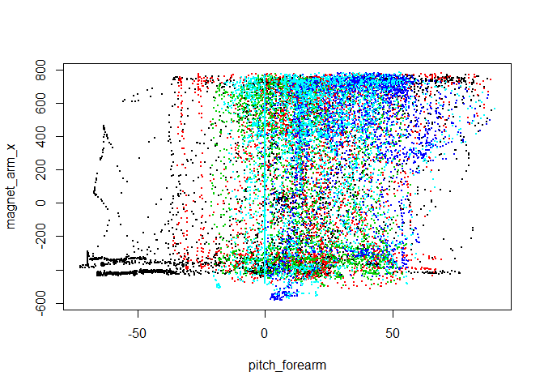
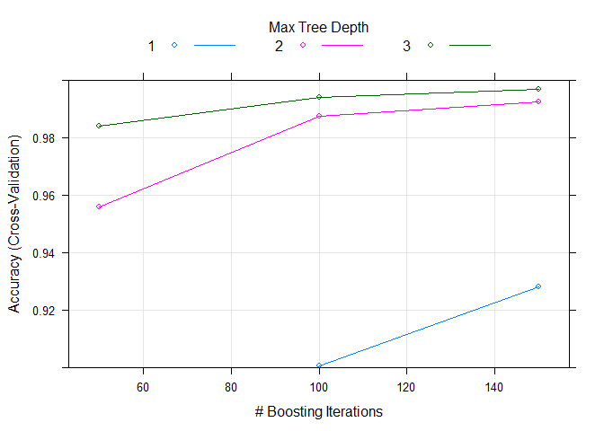

# Practical Machine Learning Project

Provided data to determine what activity an individual perform. To do this used caret and randomForest, this allowed me to generate correct answers for each of the 20 test data cases provided in this assignment. Made use of a seed value for consistent results.


```
## Warning: package 'ggplot2' was built under R version 3.1.3
```

```
## Warning: package 'randomForest' was built under R version 3.1.3
```

```
## randomForest 4.6-10
## Type rfNews() to see new features/changes/bug fixes.
```

```
## Warning: package 'caret' was built under R version 3.1.3
```

```
## Loading required package: lattice
```

```
## Warning: package 'foreach' was built under R version 3.1.3
```

```
## Warning: package 'doParallel' was built under R version 3.1.3
```

```
## Loading required package: iterators
```

```
## Warning: package 'iterators' was built under R version 3.1.3
```

```
## Loading required package: parallel
```

## Load Data

- Load data.
- Remove near zero covariates and those with more than 80% missing values since these variables will    not provide much power for prediction.
- Calculate correlations between each remaining feature to the response, classe. Use spearman rank -   based correlation because classe is a factor.
- Plot the two features that have highest correlation with classe and color with classe to see if we     can separate response based on these features.


```r
  training <- read.csv("pml-training.csv", row.names = 1)
  testing <- read.csv("pml-testing.csv", row.names = 1)
  # remove near zero covariates
  nsv <- nearZeroVar(training, saveMetrics = T)
  training <- training[, !nsv$nzv]
  # remove variables with more than 80% missing values
  nav <- sapply(colnames(training), function(x) if(sum(is.na(training[, x])) > 0.8*nrow(training)){return(T)}else{return(F)})
  training <- training[, !nav]
  # calculate correlations
  cor <- abs(sapply(colnames(training[, -ncol(training)]), function(x) cor(as.numeric(training[, x]), as.numeric(training$classe), method = "spearman")))
```


```r
# plot predictors 
summary(cor)
```

```
##     Min.  1st Qu.   Median     Mean  3rd Qu.     Max. 
## 0.001525 0.014720 0.052370 0.086210 0.137400 0.317300
```

```r
plot(training[, names(which.max(cor))], training[, names(which.max(cor[-which.max(cor)]))], col = training$classe, pch = 19, cex = 0.1, xlab = names(which.max(cor)), ylab = names(which.max(cor[-which.max(cor)])))
```

 

The training set has __19622__ samples and __57__ potential predictors after filtering.

There doesn't seem to be any strong predictors that correlates with `classe` well, so linear regression model is probably not suitable in this case. Boosting and random forests algorithms may generate more robust predictions for our data.


## Boosting model

* Fit model with boosting algorithm and 10-fold cross validation to predict `classe` with all other predictors.    
* Plot accuracy of this model on the scale `[0.9, 1]`.


```r
  set.seed(123)
  boostFit <- train(classe ~ ., method = "gbm", data = training, verbose = F, trControl = trainControl(method = "cv", number = 10))
```

```
## Loading required package: gbm
```

```
## Warning: package 'gbm' was built under R version 3.1.3
```

```
## Loading required package: survival
## Loading required package: splines
## 
## Attaching package: 'survival'
## 
## The following object is masked from 'package:caret':
## 
##     cluster
## 
## Loaded gbm 2.1.1
## Loading required package: plyr
```

```
## Warning: package 'plyr' was built under R version 3.1.3
```


```r
  boostFit
```

```
## Stochastic Gradient Boosting 
## 
## 19622 samples
##    57 predictor
##     5 classes: 'A', 'B', 'C', 'D', 'E' 
## 
## No pre-processing
## Resampling: Cross-Validated (10 fold) 
## 
## Summary of sample sizes: 17660, 17661, 17659, 17660, 17658, 17660, ... 
## 
## Resampling results across tuning parameters:
## 
##   interaction.depth  n.trees  Accuracy   Kappa      Accuracy SD
##   1                   50      0.8377343  0.7940458  0.009031656
##   1                  100      0.9004188  0.8738977  0.009393427
##   1                  150      0.9281936  0.9090330  0.006792646
##   2                   50      0.9560694  0.9443788  0.004432582
##   2                  100      0.9876160  0.9843359  0.002122153
##   2                  150      0.9924578  0.9904605  0.001917400
##   3                   50      0.9839975  0.9797572  0.002834887
##   3                  100      0.9939357  0.9923298  0.002029593
##   3                  150      0.9969425  0.9961328  0.001314715
##   Kappa SD   
##   0.011507198
##   0.011909584
##   0.008623759
##   0.005624379
##   0.002682342
##   0.002424188
##   0.003584178
##   0.002566392
##   0.001662783
## 
## Tuning parameter 'shrinkage' was held constant at a value of 0.1
## 
## Tuning parameter 'n.minobsinnode' was held constant at a value of 10
## Accuracy was used to select the optimal model using  the largest value.
## The final values used for the model were n.trees = 150,
##  interaction.depth = 3, shrinkage = 0.1 and n.minobsinnode = 10.
```

```r
  plot(boostFit, ylim = c(0.9, 1))
```

 

## Random forest model

-Fit model with random forests algorithm and 10-fold cross validation to predict classe with all other predictors.
-Plot accuracy of the model on the same scale as boosting model.


```r
  set.seed(123)
  rfFit <- train(classe ~ ., method = "rf", data = training, importance = T, trControl = trainControl(method = "cv", number = 10))
```


```r
imp <- varImp(rfFit)$importance
imp$max <- apply(imp, 1, max)
imp <- imp[order(imp$max, decreasing = T), ]
```

The random forests algorithm generated a very accurate model with accuracy close to 1. Compared to boosting model, this model generally has better performance in terms of accuracy as we see from the plots.

## Final model and prediction

-Comparing model accuracy of the two models generated, random forests and boosting, random forests model has overall better accuracy. So, I'll use this model for prediction.
-The final random forests model contains 500 trees with 40 variables tried at each split. The five most important predictors in this model are r rownames(imp)[1:5].
-Estimated out of sample error rate for the random forests model is 0.04% as reported by the final model.
-Predict the test set and output results for automatic grader.


```r
  # final model
  rfFit$finalModel
```

```
## 
## Call:
##  randomForest(x = x, y = y, mtry = param$mtry, importance = ..1) 
##                Type of random forest: classification
##                      Number of trees: 500
## No. of variables tried at each split: 40
## 
##         OOB estimate of  error rate: 0.05%
## Confusion matrix:
##      A    B    C    D    E  class.error
## A 5580    0    0    0    0 0.0000000000
## B    1 3795    1    0    0 0.0005267316
## C    0    3 3419    0    0 0.0008766803
## D    0    0    2 3213    1 0.0009328358
## E    0    0    0    1 3606 0.0002772387
```

```r
  # prediction
  (prediction <- as.character(predict(rfFit, testing)))
```

```
##  [1] "B" "A" "B" "A" "A" "E" "D" "B" "A" "A" "B" "C" "B" "A" "E" "E" "A"
## [18] "B" "B" "B"
```


```r
# write prediction files
  pml_write_files = function(x){
    n = length(x)
    for(i in 1:n){
      filename = paste0("problem_id_", i, ".txt")
      write.table(x[i], file = filename, quote = FALSE, row.names = FALSE, col.names = FALSE)
    }
  }
 pml_write_files(prediction)
```
